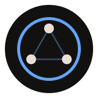

# John Siracusa

 

---

<table>
<tr>
<td valign="top" width="56">

</td>
<td valign="top">
<a href="https://github.com/harnessprotocol/harness-kit"><b>harness-kit</b></a> 
A harness-agnostic framework for AI coding tools — portable plugins, shareable config
</td>
</tr>
<tr><td colspan="2"> </td></tr>
<tr>
<td valign="top">

</td>
<td valign="top">
<a href="https://github.com/harnessprotocol"><b>Harness Protocol</b></a> 
Open specification for AI coding tool configuration and interoperability
</td>
</tr>
<tr><td colspan="2"> </td></tr>
<tr>
<td valign="top">

</td>
<td valign="top">
<a href="https://hometownmediatn.com"><b>Hometown Media</b></a> 
Website for a Tennessee-based sports social media agency
</td>
</tr>
</table>

 

---

&nbsp;&nbsp;

