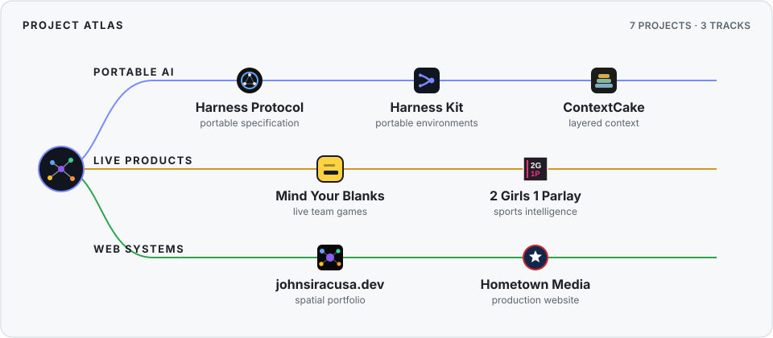

  <strong>Software engineer building portable AI systems and production web products.</strong> 
  Coding environments, context infrastructure, interactive software, and the systems behind them.

  <a href="https://johnsiracusa.dev">Portfolio</a> &nbsp;·&nbsp;
  <a href="https://linkedin.com/in/siracusa5">LinkedIn</a>

<picture>
  <source media="(max-width: 600px)" srcset="assets/project-atlas-mobile.svg">
  
</picture>

## Project index

### Portable AI

   <strong><a href="https://harnessprotocol.ai">Harness Protocol</a></strong> · <code>YAML</code> <code>JSON Schema</code> <code>Open standard</code> 
  A portable specification for AI coding configurations. <a href="https://github.com/harnessprotocol/harness-protocol">Source</a> · <a href="https://harnessprotocol.ai/docs">Docs</a>

   <strong><a href="https://harnesskit.ai">Harness Kit</a></strong> · <code>TypeScript</code> <code>macOS</code> <code>CLI</code> 
  A toolkit for defining and sharing AI coding environments. <a href="https://github.com/harnessprotocol/harness-kit">Source</a> · <a href="https://harnesskit.ai/docs">Docs</a>

   <strong><a href="https://contextcake.com">ContextCake</a></strong> · <code>JavaScript</code> <code>macOS</code> <code>Node.js</code> 
  Layered context resolution for AI agents from local folders and GitHub repositories. <a href="https://github.com/ContextCake/context-cake">Source</a> · <a href="https://contextcake.com/docs">Docs</a> · <a href="https://contextcake.com/install">Install</a>

### Live products

   <strong><a href="https://mindyourblanks.com">Mind Your Blanks</a></strong> · <code>Go</code> <code>Next.js</code> <code>Web</code> 
  Live and on-demand games with host controls, administration, and production tooling.

   <strong><a href="https://2girls1parlay.com">2 Girls 1 Parlay</a></strong> · <code>React</code> <code>Vite</code> <code>TypeScript</code> 
  Sports coverage, live scores, player-prop research, daily picks, and prediction tracking.

### Web systems

   <strong><a href="https://johnsiracusa.dev">johnsiracusa.dev</a></strong> · <code>Canvas</code> <code>Native JavaScript</code> 
  A spatial, canvas-based portfolio for exploring projects and capabilities.

   <strong><a href="https://hometownmediatn.com">Hometown Media</a></strong> · <code>Production website</code> 
  A marketing site for a Tennessee sports, lifestyle, and content media agency.

