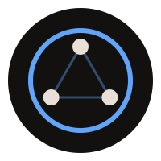
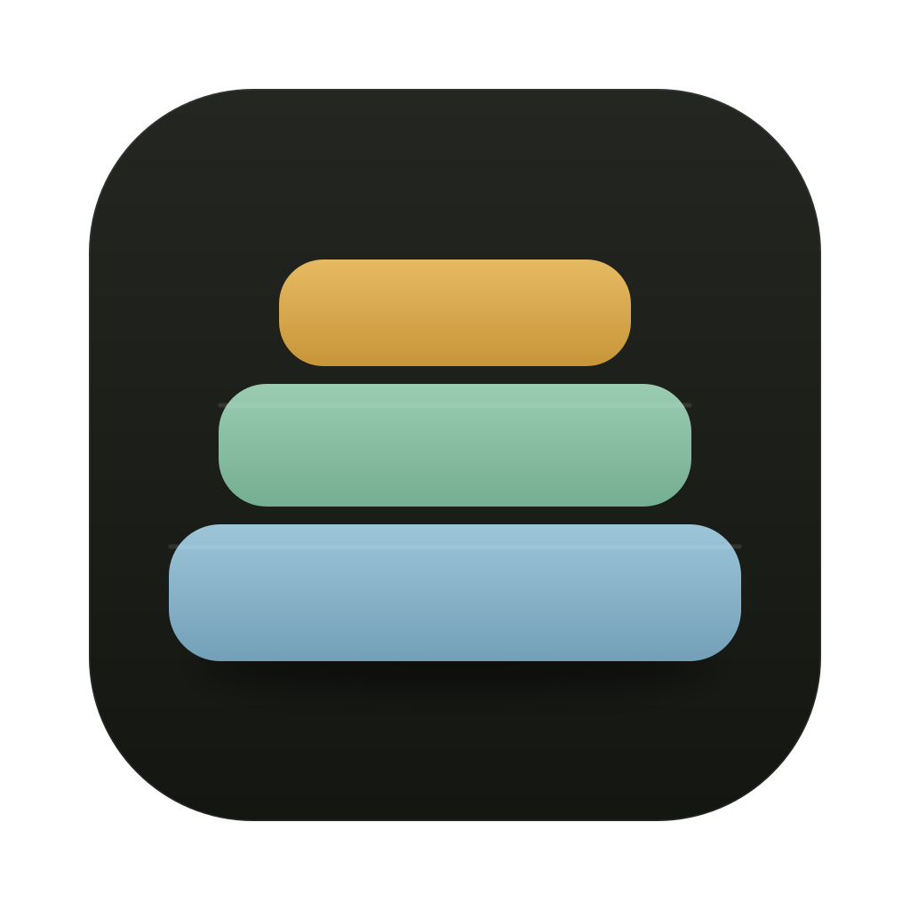

# John Siracusa

 

---

## Selected work

<table>
<thead>
<tr>
<th align="left">Project</th>
<th align="left">Category</th>
<th align="left">Available on</th>
</tr>
</thead>
<tbody>
<tr>
<td valign="top" width="54">
 
<a href="https://johnsiracusa.dev"><b>johnsiracusa.dev</b></a> 
An interactive portfolio that maps projects and capabilities on a canvas, built with native web technologies.
</td>
<td valign="top"><b>Portfolio website</b> Interactive web experience</td>
<td valign="top"><b>Browser</b> Responsive web</td>
</tr>
<tr>
<td valign="top">
 
<a href="https://github.com/harnessprotocol/harness-kit"><b>harness-kit</b></a> 
A toolkit for keeping AI coding environments consistent across editors, machines, and teams. 
<a href="https://harnesskit.ai">Website</a> · <a href="https://harnesskit.ai/docs">Documentation</a>
</td>
<td valign="top"><b>Developer tool</b> Desktop app and CLI</td>
<td valign="top"><b>macOS app</b> CLI for local development</td>
</tr>
<tr>
<td valign="top">
 
<a href="https://github.com/harnessprotocol/harness-protocol"><b>Harness Protocol</b></a> 
An open specification for portable AI coding configurations that can move between tools and teams. 
<a href="https://harnessprotocol.ai">Website</a> · <a href="https://harnessprotocol.ai/docs">Documentation</a>
</td>
<td valign="top"><b>Open standard</b> Configuration specification</td>
<td valign="top"><b>Browser</b> Compatible coding tools</td>
</tr>
<tr>
<td valign="top">
 
<a href="https://github.com/siracusa5/context-cake"><b>ContextCake</b></a> 
A layered knowledge system that gives AI agents a resolved view of company, team, and personal context. 
<a href="https://contextcake.com">Website</a> · <a href="https://contextcake.com/docs">Documentation</a>
</td>
<td valign="top"><b>Developer platform</b> Local engine and web console</td>
<td valign="top"><b>Local Node.js</b> Browser console</td>
</tr>
<tr>
<td valign="top">
 
<a href="https://mindyourblanks.com"><b>Mind Your Blanks</b></a> 
A daily team game platform with asynchronous play, live meeting modes, and an admin console.
</td>
<td valign="top"><b>Web application</b> Team games</td>
<td valign="top"><b>Browser</b> Desktop and mobile</td>
</tr>
<tr>
<td valign="top">
 
<a href="https://2girls1parlay.com"><b>2 Girls 1 Parlay</b></a> 
A sports editorial site with live scores, prediction tracking, and a public record for every pick.
</td>
<td valign="top"><b>Sports media site</b> Editorial and prediction tracking</td>
<td valign="top"><b>Browser</b> Responsive web</td>
</tr>
<tr>
<td valign="top">
 
<a href="https://hometownmediatn.com"><b>Hometown Media</b></a> 
A full web presence for a Tennessee sports media agency, designed to showcase work and support client inquiries.
</td>
<td valign="top"><b>Agency website</b> Marketing and portfolio</td>
<td valign="top"><b>Browser</b> Responsive web</td>
</tr>
</tbody>
</table>

 

---

